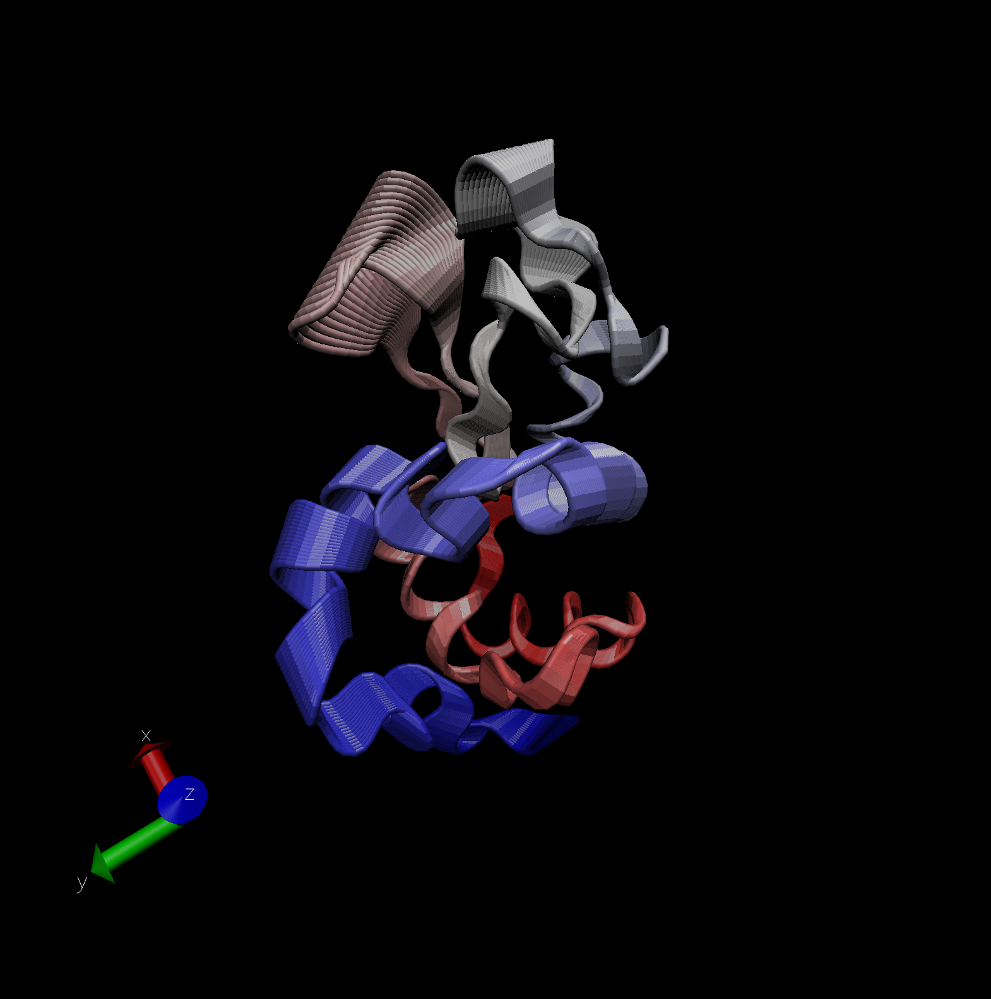

# This is a continuation of our previous lab activity. We will be working with bio3d.

```{r}
library(bio3d)
pdb <- read.pdb("1hel")
pdb
```
```{r}
head(pdb$atom)
```
Next, let's perform a quick bioinformatics prediction of protein dynamics (flexbility). We will use the `nma()` function, which does Normal Mode Analysis.

```{r}
modes <- nma(pdb)
plot(modes)
```

Now, let's make a trajectory ("movie") of this prediction with the `mktrj()` function.

```{r}
mktrj(modes, file="nma.pdb")
```

Insert the image from VMD that we created.



# Next, we are going to obtain a sequence and search the PDB database. Then, we can make a structural representation.

## Comparative Structure Analysis

Begin by getting a sequence of interest.

```{r}
aa <- get.seq("1AKE_A")
aa
```
Why do we do this? We want to search the PDB database (the main db for exp. structures) for sequences like the aa sequence we are using here.

```{r}
blast <- blast.pdb(aa)
```

```{r}
hits <- plot(blast)
```

Now, we have the top hits from the search of the PDB

```{r}
hits$pdb.id
```

Here, we will download all these similar structures that are in the PDB and store them on our own computer.

```{r}
# Download releated PDB files
files <- get.pdb(hits$pdb.id, path="pdbs", split=TRUE, gzip=TRUE)
```

The signal we get comes from MSA. To get this, we will need to install a package. We want to align all these structures, so we will use the function `pdbaln()`

```{r}
# Align related PDBs
pdbs <- pdbaln(files, fit = TRUE)
```

Let's now look:

```{r}
pdbs
```

```{r}
# Vector containing PDB codes for figure axis
ids <- basename.pdb(pdbs$id)

# Draw schematic alignment
plot(pdbs, labels=ids)
```
```{r}
pdbs$xyz
```

## Principal Component Analysis (PCA)

Here, we will do PCA on the xyz coordinate data of all these structures. We will use the `pca()` function in the bio3d package.

```{r}
pc <- pca(pdbs)
plot(pc)
```

Next, let's visualize the displacements (i.e. movements of the structure) that are captured by PC1.

```{r}
mktrj(pc, pc=1, file="pca.pdb")
```

Let's save the important results we have generated:

```{r}
#save(blast, hits, pca, pdbs, file="myresults.RData")
#load("myresults.RData")
```


