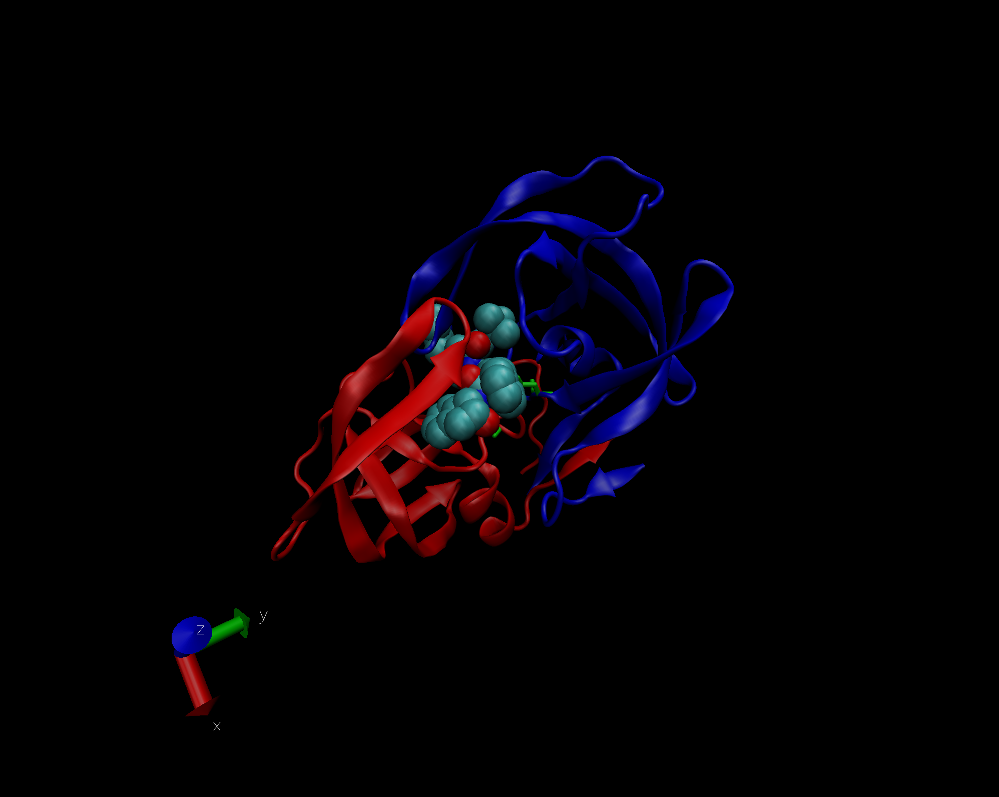

# First, we need to obtain some data from the PDB website.

```{r}
pdb.data <- read.csv("Data Export Summary.csv", row.names=1)
pdb.data
```

> **Q1**. What percentage of structures in the PDB are solved by X-Ray and Electron Microscopy?

For x-ray:
```{r}
sum(pdb.data$X.ray)
sum(pdb.data$Total)
round((sum(pdb.data$X.ray) / sum(pdb.data$Total)) * 100, 2)
```
For electron microscopy:

```{r}
sum(pdb.data$EM)
sum(pdb.data$Total)
round((sum(pdb.data$EM) / sum(pdb.data$Total)) * 100, 2)
```

```{r}
colSums(pdb.data) / sum(pdb.data$Total) * 100
```

> **Q2**. What proportion of structures in the PDB are protein?

```{r}
pdb.data$Total[1]
round((pdb.data$Total[1]/sum(pdb.data$Total)) * 100, 2)
```

> **Q3**. Type HIV in the PDB website search box on the home page and determine how many HIV-1 protease structures are in the current PDB?

When searching for "HIV protease", there are 107 structures in the current PDB.

# We used VMD to render a 3-D image.



> **Q4**. Water molecules normally have 3 atoms. Why do we see just one atom per water molecule in this structure?

The resolution of this structure is at 2 Angstroms, and in order to visualize the full numbers of atoms, we would need a structure with a resolution of 1 Angstrom.

> **Q5**. There is a conserved water molecule in the binding site. Can you identify this water molecule? What residue number does this water molecule have (see note below)?

Yes. We can identify this water molecule at residue number 308.

# Using Bio3D in R for structural bioinformatics

```{r}
library(bio3d)
pdb <- read.pdb("1hel")
pdb
```

```{r}
pdb$atom
```

# Perform a normal mode analysis (NMA)--  a prediction of the conformational variability and intrinsic dynamics of this protein.

```{r}
pdb <- read.pdb("1hel")
m <- nma(pdb)
plot(m)
```
# Make a trajectory for viewing in VMD.
```{r}
mktrj(m, file="nma.pdb")
```


