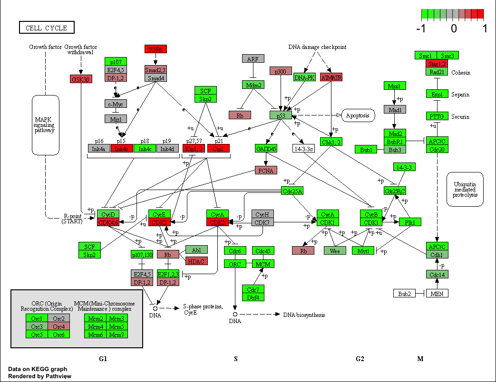

# The workflow for this mini project will be as follows:

1) Data import/read (countdata and coldata)
2) PCA (QC)
3) DESeq analysis
4) Volcano plot

```{r}
library(DESeq2)
metaFile <- "GSE37704_metadata.csv"
countFile <- "GSE37704_featurecounts.csv"
```

# Import metadata and take a peak

```{r}
colData = read.csv(metaFile, row.names=1)
head(colData)
```

# Import countdata

```{r}
countData = read.csv(countFile, row.names=1)
head(countData)
```

```{r}
# Note we need to remove the odd first $length col
countData1 <- as.matrix(countData[,-1])
head(countData1)
```
```{r}
# Filter count data where you have 0 read count across all samples.
countData1 = countData1[-which(rowSums(countData1) == 0), ]
head(countData1)
```
# Now, let's try to run PCA

```{r}
pca <- prcomp(t(countData1))
plot(pca$x[,1:2])
```

# Now, let's set up the DESeqDataSet object required for the DESeq() function and then run the DESeq pipeline. This is again similar to our last day's hands-on session.

```{r}
dds = DESeqDataSetFromMatrix(countData=countData1,
                             colData=colData,
                             design=~condition)
dds = DESeq(dds)
dds
```

# Next, get results for the HoxA1 knockdown versus control siRNA (remember that these were labeled as "hoxa1_kd" and "control_sirna" in our original colData metaFile input to DESeq; you can check this above and by running the `resultsNames(dds)` command).

```{r}
res = results(dds)
summary(res)
```

# Now we will make a volcano plot, a commonly produced visualization from this type of data that we introduced last day. Basically, it's a plot of log2 fold change vs -log adjusted p-value.

```{r}
plot( res$log2FoldChange, -log(res$padj) )
```

# Now, let's add some color to this volcano plot.

```{r}
# Make a color vector for all genes
mycols <- rep("gray", nrow(res) )

# Color red the genes with absolute fold change above 2
mycols[ abs(res$log2FoldChange) > 2 ] <- "red"

# Color blue those with adjusted p-value less than 0.01
#  and absolute fold change more than 2
inds <- (res$pvalue < 0.01) & (abs(res$log2FoldChange) > 2 )
mycols[ inds ] <- "blue"

plot( res$log2FoldChange, -log(res$padj), col=mycols, xlab="Log2(FoldChange)", ylab="-Log(P-value)" )
```

# Since we mapped and counted against the Ensembl annotation, our results only have information about Ensembl gene IDs. However, our pathway analysis downstream will use KEGG pathways, and genes in KEGG pathways are annotated with Entrez gene IDs. So, let's add them as we did the last day.

Use the `mapIDs()` function multiple times to add SYMBOL, ENTREZID and GENENAME annotation to our results by completing the code below.

```{r}
library("AnnotationDbi")
library("org.Hs.eg.db")

columns(org.Hs.eg.db)

res$symbol = mapIds(org.Hs.eg.db,
                    keys=row.names(res), 
                    keytype="ENSEMBL",
                    column="SYMBOL",
                    multiVals="first")

res$entrez = mapIds(org.Hs.eg.db,
                    keys=row.names(res),
                    keytype="ENSEMBL",
                    column="ENTREZID",
                    multiVals="first")

res$name =   mapIds(org.Hs.eg.db,
                    keys=row.names(res),
                    keytype="ENSEMBL",
                    column="GENENAME",
                    multiVals="first")

head(res, 10)
```

# Finally for this section, let's reorder these results by adjusted p-value and save them to a CSV file in your current project directory.

```{r}
res = res[order(res$pvalue),]
write.csv(res, file="deseq_results.csv")
```

# Here, we are going to use the gage package for pathway analysis. Once we have a list of enriched pathways, we're going to use the pathview package to draw pathway diagrams, shading the molecules in the pathway by their degree of up/down-regulation.

The gageData package has pre-compiled databases mapping genes to KEGG pathways and GO terms for common organisms. kegg.sets.hs is a named list of 229 elements. Each element is a character vector of member gene Entrez IDs for a single KEGG pathway. (See also go.sets.hs). The sigmet.idx.hs is an index of numbers of signaling and metabolic pathways in kegg.set.gs. In other words, KEGG pathway include other types of pathway definitions, like "Global Map" and "Human Diseases", which may be undesirable in a particular pathway analysis. Therefore, kegg.sets.hs[sigmet.idx.hs] gives you the "cleaner" gene sets of signaling and metabolic pathways only.

Side-Note: While there are many freely available tools to do pathway analysis, and some like gage are truly fantastic, many of them are poorly maintained or rarely updated. The DAVID tool that a lot of folks use for simple gene set enrichment analysis was not updated at all between Jan 2010 and Oct 2016.

# First, we need to do our one time install of these required bioconductor packages:

```{r}
library(pathview)
library(gage)
library(gageData)

data(kegg.sets.hs)
data(sigmet.idx.hs)
```

```{r}
# Focus on signaling and metabolic pathways only
kegg.sets.hs = kegg.sets.hs[sigmet.idx.hs]
```

```{r}
# Examine the first 3 pathways
head(kegg.sets.hs, 3)
```

```{r}
foldchanges = res$log2FoldChange
names(foldchanges) = res$entrez
head(foldchanges)
```

```{r}
# Get the results
keggres = gage(foldchanges, gsets=kegg.sets.hs)
```

```{r}
attributes(keggres)
```

```{r}
# Look at the first few down (less) pathways
head(keggres$less)
```

Each keggres$less and keggres$greater object is data matrix with gene sets as rows sorted by p-value.

The top "less/down" pathways is "Cell cycle" with the KEGG pathway identifier hsa04110.

Now, let's try out the pathview() function from the pathview package to make a pathway plot with our RNA-Seq expression results shown in color.
To begin with lets manually supply a pathway.id (namely the first part of the "hsa04110 Cell cycle") that we could see from the print out above.

```{r}
pathview(gene.data=foldchanges, pathway.id="hsa04110")
```

# A different PDF based output of the same data
```{r}
pathview(gene.data=foldchanges, pathway.id="hsa04110", kegg.native=FALSE)
```


Now, let's process our results a bit more to automagicaly pull out the top 5 upregulated pathways, then further process that just to get the pathway IDs needed by the pathview() function. We'll use these KEGG pathway IDs for pathview plotting below.

```{r}
## Focus on top 5 upregulated pathways here for demo purposes only
keggrespathways <- rownames(keggres$greater)[1:5]
```

```{r}
# Extract the 8 character long IDs part of each string
keggresids = substr(keggrespathways, start=1, stop=8)
keggresids
```

Finally, let's pass these IDs in keggresids to the `pathview()` function to draw plots for all the top 5 pathways.

```{r}
pathview(gene.data=foldchanges, pathway.id=keggresids, species="hsa")
```


